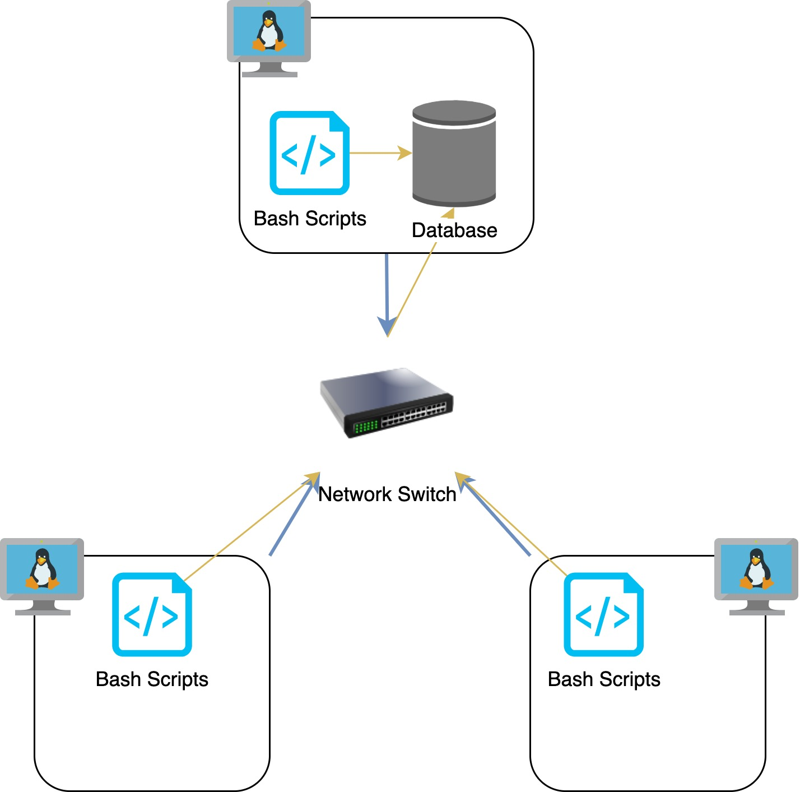

# Linux Cluster Monitoring Agent
This project is used to recording the hardware specifications in real-time and storing data into an RDBMS.

## Introduction
This is a MVP project for The Jarvis Linux Cluster Administration, which implemented single host scripts.

## Architecture


## Quick Start
Start a psql instance using psql_docker.sh
```
bash scripts/psql_docker.sh start|stop|create [db_username] [db_password]
```

Create tables using ddl.sql
```
psql -h localhost -U postgres -d host_agent -f sql/ddl.sql
```

Insert hardware specs data into the DB using host_info.sh
```
bash scripts/host_info.sh psql_host psql_port db_name psql_user psql_password
```

Insert hardware usage data into the DB using host_usage.sh
```
bash scripts/host_usage.sh psql_host psql_port db_name psql_user psql_password
```
